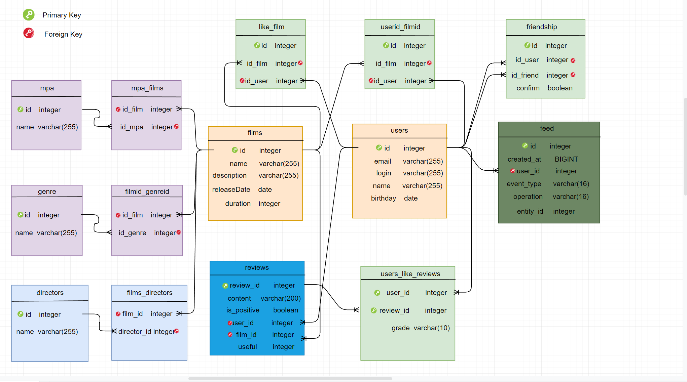

# Welcome to FILMORATE of team number 6!

## team and functionality:
1. [Александр (TeamLead)](https://github.com/qwerty-yhn):
    * Функциональность «Рекомендации»
   

2. [Максим](https://github.com/Mazhanov):
    * Добавление режиссёров в фильмы
    * Вывод самых популярных фильмов по жанру и годам

3. [Андрей](https://github.com/misandr):
    * Функциональность «Поиск»
    * Функциональность «Общие фильмы»

4. [Георгий](https://github.com/57Dragn57):
    * Функциональность  «Отзывы»

5. [Пётр](https://github.com/PetrVladimirovich):
    * Удаление фильмов и пользователей
    * Функциональность «Лента событий»
## ER-diagram DB:

